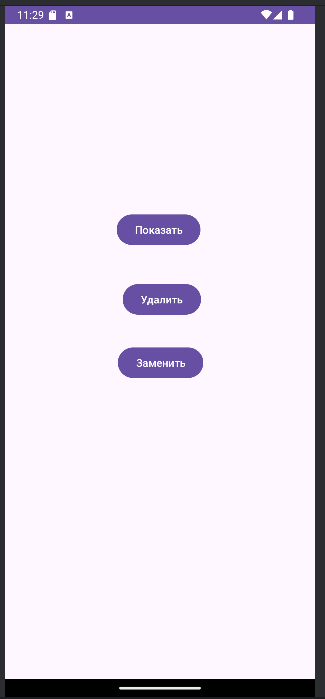
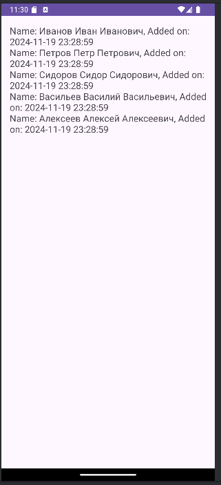
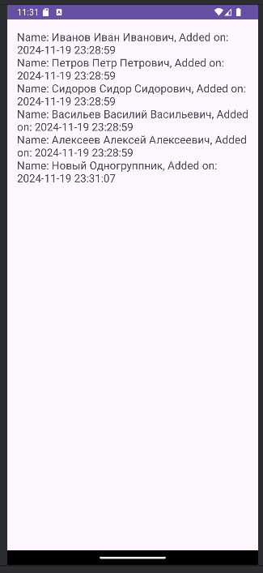
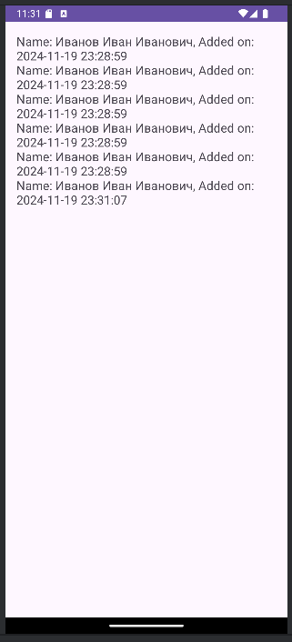

# Лабораторная работа №2: Работа с базой данных
---
Выполнила: **Мызникова Анастасия**  
Язык программирования: **Java**   
БД: **SQLite**
---
## Описание приложения
Часть 1
Приложение Android имеет два экрана (MainActivity и GroupmatesActivity).
На первом экране (MainActivity) содержится три кнопки. При нажатии на первую кнопку открывается новое активити, выводящее информацию из таблицы «Одногруппники».
Второй экран представляет собой текстовое поле, с помощью которого и выводится список одногруппников.
Таблица содержит следующие поля:   
1. ID;   
2. ФИО;   
3. Время добавления записи   
При нажатии на вторую кнопку удаляется один одногруппник и сменяется на нового.
при нажатии на третью кнопку одногруппники заменяются на Иванова Ивана Ивановича.

---
## Скриншоты

---
# Установка и запуск приложения

Следуйте этим инструкциям, чтобы установить и запустить приложение на своем компьютере.

## Требования

- Установленный [Java JDK](https://www.oracle.com/java/technologies/javase-jdk11-downloads.html) (версия 11 или выше)
- Установленный [Android Studio](https://developer.android.com/studio) (для Android-приложений)

## Установка

1. **Склонируйте репозиторий:**
2. **Перейдите в папку проекта:**
3. **Настройте проект:**
4. **Установите необходимые зависимости:**

## Запуск

1. **Запустите Android-эмулятор или подключите устройство:**
    - Создайте эмулятор в Android Studio через AVD Manager или подключите Android-устройство через USB.

2. **Запустите приложение:**

   Нажмите на кнопку "Run" (Зеленая треугольная кнопка) в Android Studio.
